I recently did a talk on how you can [analyse images with the Azure Computer Vision Service](https://youtu.be/O_kNIIFGam0). While preparing for the talk, I was excited about all the different use cases of the computer vision and decided to go ahead and build a simple app to demonstrate a simple use case of the computer vision service.

<iframe width="560" height="315" src="https://www.youtube.com/embed/O_kNIIFGam0" title="YouTube video player" frameborder="0" allow="accelerometer; autoplay; clipboard-write; encrypted-media; gyroscope; picture-in-picture" allowfullscreen></iframe>

## What are we building?

As a designer I am always stumped trying to decide the right colour for a brand. As I explored the different use cases for Azure Computer Vision service, I came across detecting colour schemes in images. Using Computer Vision Service, you can extract dominant and accent colours in different images to provide sample colours you can use for the different brands.

💡 Intrigued, I decided to go ahead and build a simple colour picker application with Flask and Azure.


**For this tutorial, we will create simple colour picker to help you create the perfect brand colour that perfectly matches your favourite images.** I will cover how to build an end-to-end build of the application under the following topics:

- Hello World in Flask
- Deploying your App on Azure Web Apps
- Provisioning a Computer Vision Resource
- Build a Colour Picker with Flask App and Azure Cognitive Services

## **Prerequisites**

**If you are just starting out with Azure and Flask, this is for you.** In order to complete this tutorial, you’ll need: 

- Foundational GitHub and python knowledge
- Python and Visual Studio Code installed on your computer
- Access to Microsoft Azure

## Hello World in Flask

Flask is a backend web framework written in Python. Unlike Django, flask is easy to set up and get started with as a beginner. In this section, I will show you how you can create a simple Hello World web application in Flask.

- First, create a new folder and open it in Visual Studio Code. Once in Visual Studio, follow the steps below:
    - Create a virtual environment. `venv` is a python module that enables you to **create isolated Python environments that their own copy of python and python libraries**. This allows you to work on multiple projects at the same time. To create a virtual environment, type in the command below in your terminal.
    
    ```bash
    py -m venv env
    ```
    
    - Next, activate the virtual environment using the code below:
    
    ```bash
    env\Scripts\activate
    ```
    
    - Once you have successfully created the virtual environment, you will need to install the dependencies and libraries to use in your project. To do this, first create a new file named `requirements.txt`. In this file add the libraries you will need to install, in our case that will be flask. Next, install requirements using the command below:
    
    ```bash
    pip install -r requirements.txt
    ```
    
    - Now that you are all set, we can dive into creating our hello world app. Create a new file `app.py`. In this file we will add our flask code to print Hello World.
    
    ```python
    #Importing the Flask class from flask
    from flask import Flask
    
    app = Flask(__name__)
    @app.route("/")
    def helloWorld():
        return "Hello World"
    ```
    
    Below is a detailed explanation of the code you have just written:
    
    - First, we import Flask class.
    - Next, we assign the imported Flask module to our core application
    - Using `@app.route`, we indicate which path we will access the app.
    - The `helloWorld` function tells us what we want rendered in the browser
    - We then run the application locally to ensure we can see Hello World on our browser. On the terminal, type the command `flask run` to deploy the application. Once the app successfully runs, you will be able to access it at [http://127.0.0.1:5000/](http://127.0.0.1:5000/)
    
    ```bash
    flask run
    ```
    
    - Before we go to the next step, upload the code to GitHub. GitHub enables you to not only track changes in you make in your applications but also using GitHub Actions you can automate future deployments.  You can do this directly on Visual Studio Code. On your right, select source control and publish your code to GitHub as shown below:
    
    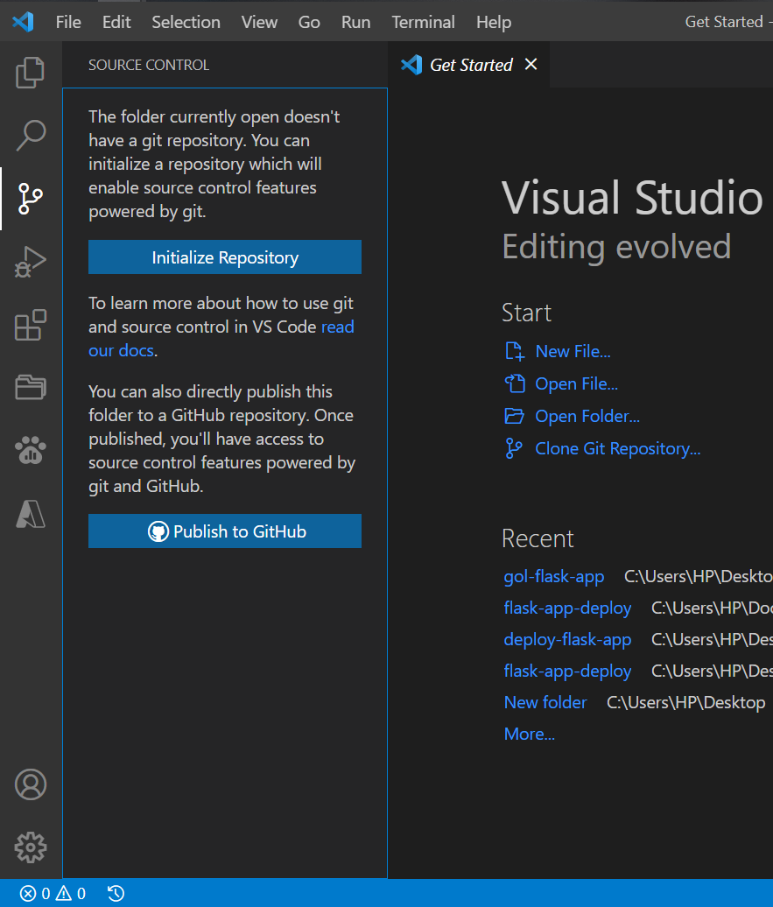
    
## Deploying your app on Azure Web App
    
    To share our application publicly, we will need to deploy it. [Azure Web Apps](https://azure.microsoft.com/en-us/services/app-service/web/) not only enables us to deploy our web applications but also grants us continuous deployment from Azure DevOps, GitLab, GitHub and many other sources. In this section, we will cover how you can deploy your web application on Azure using Azure Web Apps.
    
    - First, sign into the [Azure Portal](https://portal.azure.com/) with your Microsoft Account and create a new resource.
    
    
    
    - Click on Web App. If you cannot be able to find it, go ahead and search for it in the search bar.
    
    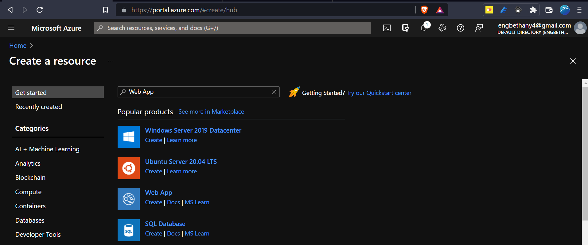
    
    - Create you web app using the configurations below:
        
        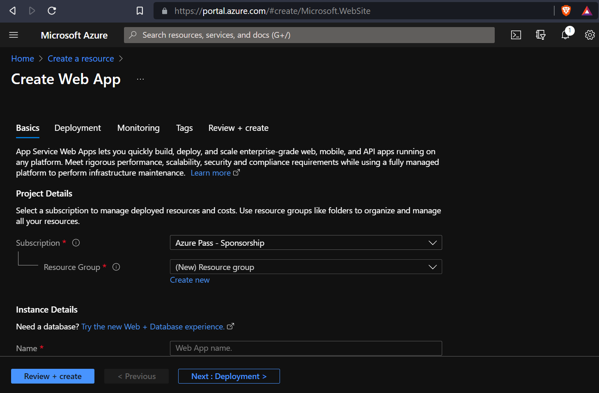
        
        - **Subscription**: *Your subscription*
        - **Resource group**:
            - Select **Create new**
            - Name: **colour-picker-app**
        - **Name**: *A unique value, such as colour-picker-2343*
        - **Publish**: *Code*
        - **Runtime stack:** *Python 3.9*
        - **Operating System:** *Linux*
        - **Region:** *select a region close to you*
        - **App Service Plan:**
            - **Linux Plan:** create new, name colour-picker
            - **Sku and size:** change size to **Free F1**
            
            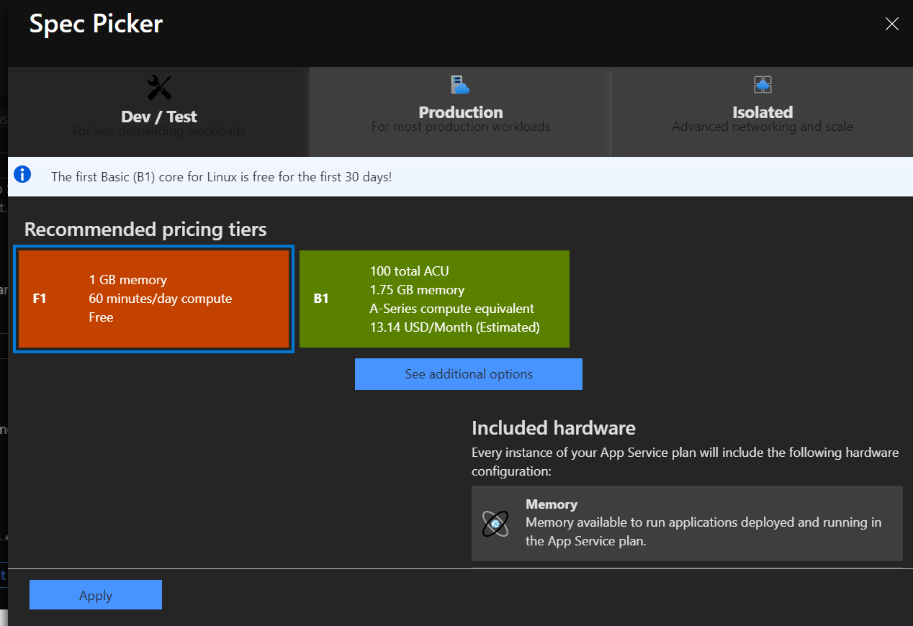
            
    - Select Review + Create then select Create to create you web app. It will take a few minutes to create your web app.
    
    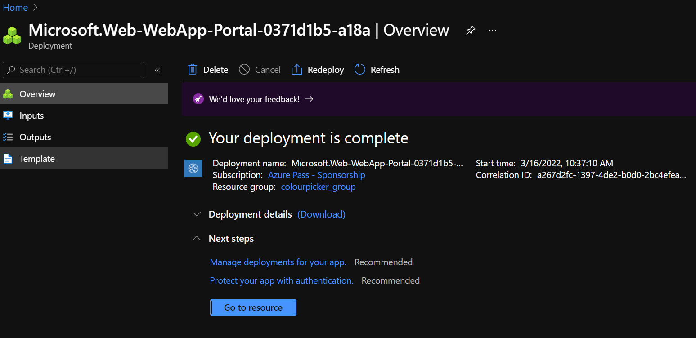
    
    - On your resource dashboard, you will see the application URL. Click to see what you have deployed.
    
    
    
    - Your web app is now running but you are yet to add content. As we have already published our code on GitHub, click on the deployment centre to publish your code.
    
    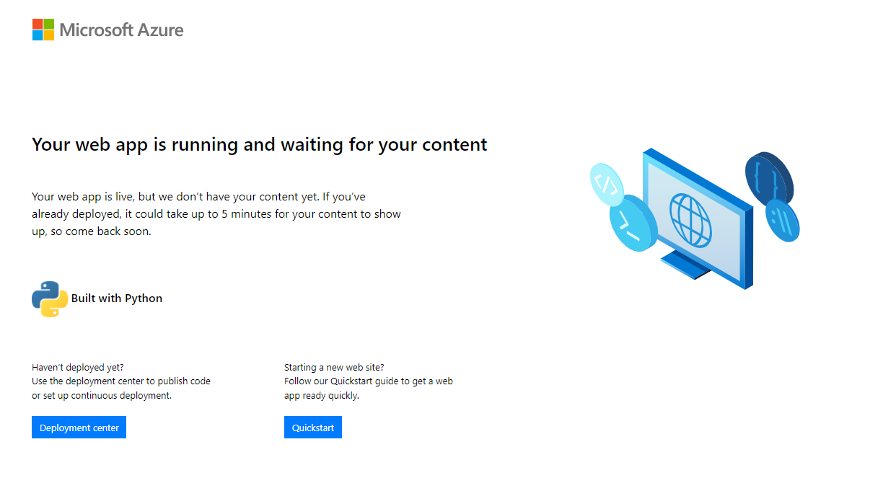
    
    - In this stage, we will get our code from GitHub build our pipeline with GitHub Actions.
    
    
    
    - **Source**: *GitHub*
    - **Authenticate connection to your GitHub Account**
    - **Organization**: *If you have multiple organizations select the organization where you saved you repository*
    - **Repository**: *Connect to the repository you just created, in our case: flask-app-deploy*
    - **Branch**: *master*
    - Select Save. Your application will be deployed in the background. You can check out the deployment progress under logs or on GitHub under actions. Once deployment is done, go ahead and refresh your website URL.
    
    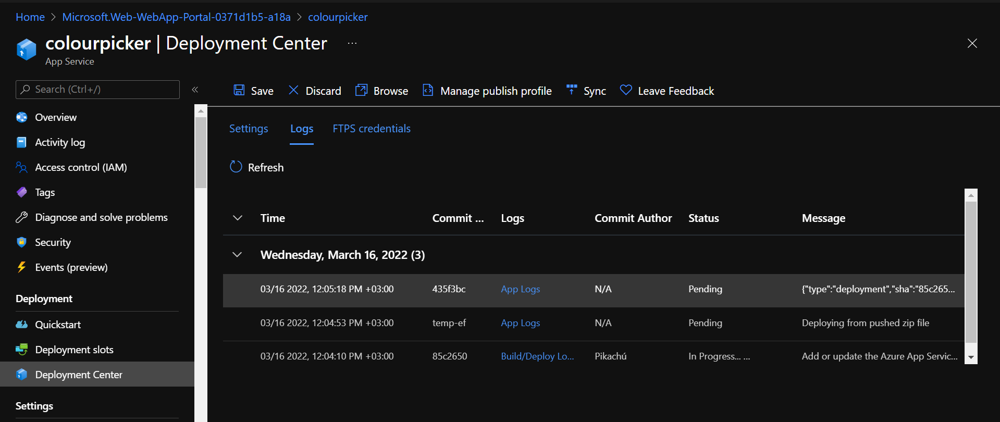
    
    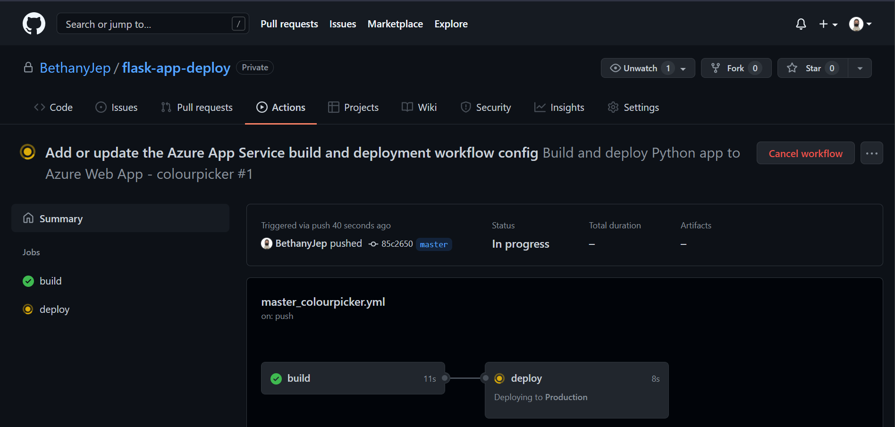
    
- Now that our website has deployed successfully 👇, the next step is to provision a Computer Vision Resource that will help us analyse our image.


## Provisioning a Computer Vision resource

Computer Vision is a field in Artificial Intelligence that allows applications to gain insights on digital images or videos. Azure pre-trained computer vision service provides pre-built computer vision capabilities. In this next step, we will provision an Azure Computer Vision Resource:

- Let’s go back to the [Azure Portal](https://portal.azure.com/) whereby we will create a Computer Vision resource.

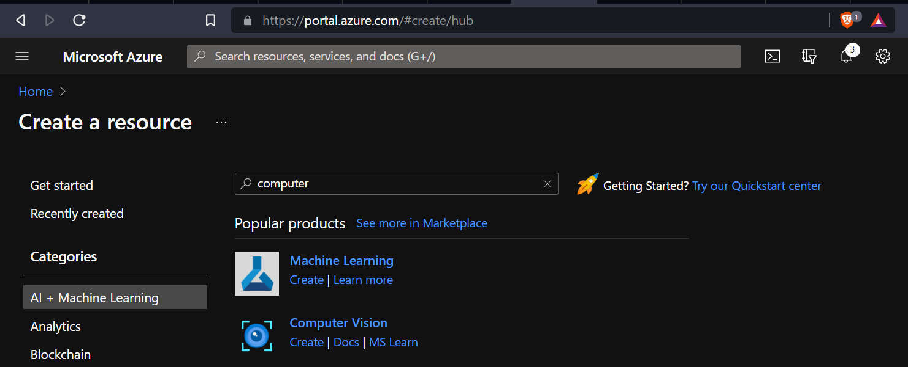

- Create the computer vision resource
    - **Subscription**: *Your subscription*.
    - **Resource group**: *Select or create a new resource group*.
    - **Region**: *Choose a region close to you*
    - **Name**: *Enter a unique name for the computer vision service.*
    - **Pricing tier**: *Free F0 (20 Calls per minute, 5K Calls per month)*
    - **Ensure you select:** *By checking this box I certify that I have reviewed and acknowledge the all the terms above.*
- Select Review and create then Create to create you resource. Once the resource is deployed, you will be able go get you API keys and endpoint. We will use the endpoint to access the resource and the API key to authenticate our connection.

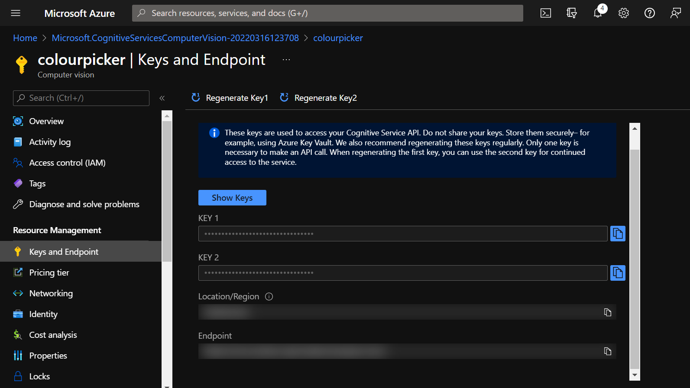

- The Computer Vision service analyses the image and provides the: dominant colours, accent colour, whether an image is black and white and the image metadata. The response is in JSON as shown below. In the next step, we will add features to our Flask application to be able to return an image’s colour scheme.

```json
{'color': {'accentColor': '322419',
  'dominantColorBackground': 'Brown',
  'dominantColorForeground': 'Brown',
  'dominantColors': ['Brown', 'Grey'],
  'isBWImg': False,
  'isBwImg': False},
 'metadata': {'format': 'Jpeg', 'height': 900, 'width': 600},
 'requestId': '36ab3b0a-06e5-4704-a43a-4020c03115b7'}
```

## Build a Colour Picker with Flask App and Azure Cognitive Services

As we earlier mentioned:

- Create the application front-end using HTML
    - Create a new folder named `templates`.
    - Under the new templates folder, add a new file called index.html. In the file add the HTML code below. We are creating a URL field where one will paste the image URL to generate colours in the image. Additionally, a core concept is the input name `ImageSelected` which we will use in our model.
    
    ```bash
    <!DOCTYPE html>
    <html lang="en">
    <head>
        <meta charset="UTF-8">
        <meta http-equiv="X-UA-Compatible" content="IE=edge">
        <meta name="viewport" content="width=device-width, initial-scale=1.0">
        <title>Colour Pallette</title>
    </head>
    <body>
        <h1>Colour Picker from Image</h1>
        <form class="container" id="form1" method="POST" >
          <label for="imageURL" class="label">Paste Image URL</label> <br/>
          <div class="formInput">
            <input type="url" name="ImageSelected" placeholder="https://" id="">
            <input type="submit" class="button" value="Generate Colours"/>
          </div>
          </form>
    </body>
    </html>
    ```
    
    - Under the templates folder, we will also add a new file palette.html. This file will render the output of the model. Add the code below to the new file you just created. One thing to note in the code below is the parameters enclosed by `{{}}`. For example, the parameter `{{ dominantCOLOURS }}` tells Flask to render the results from the model as plain text.
    
    ```bash
    <!DOCTYPE html>
    <html lang="en">
    <head>
        <meta charset="UTF-8">
        <meta http-equiv="X-UA-Compatible" content="IE=edge">
        <link rel="stylesheet" href="/static/style.css">
        <meta name="viewport" content="width=device-width, initial-scale=1.0">
        <title>Document</title>
    </head>
    <body>
        <div class="container">
            <h1>Colour Picker</h1>
            <h2><strong>Results</strong> </h2>
            <div class="imageResults">
                <div>
                    
                </div>
                <div class="imageDesc">
                    <p><strong>Dominant Colours:</strong> {{ dominantCOLOURS }}</p>
                    <p><strong>Accent Colour:</strong> {{ accentCOLOUR }}</p>
                    <p><strong>Is the image Black & White:</strong> {{ blackWHITE }}</p>
                </div>
            </div>
    
            <div>
                <strong>Try another image: </strong>
                <a href="/"><button class="button">New Image</button></a>
            </div>
        </div>
    </body>
    </html>
    ```
    
- Style the code with CSS
    - To style the HTML, we will be using CSS. Create a new folder named static. In the new folder create the file `style.css` then add the code below.
    
    ```bash
    @import url('https://fonts.googleapis.com/css2?family=Outfit:wght@100;200;300;400;500;600;700;800;900&display=swap');
    
    body{
        font-family: 'Outfit', sans-serif;
    }
    h1{
        text-align: center;
    }
    .label{
        text-align: left;
        margin: 5px;
    }
    
    .formInput{
        display: flex;
        flex-direction: column;
        justify-content:center;
    }
    img{
        width: 200px;
        height: auto;
        padding: 15px;
        border-radius: 20px;
    }
    .imageResults{
        display: flex;
        flex-direction: row;
        background-color: #dff5f4;
        border-radius: 10px;
        width: 60%;
        margin-bottom: 20px;
    }
    input{
        margin: 5px;
        padding: 5px;
        border-radius: 5px;
    }
    .button{
        padding: 8px;
        margin: 0px 5px;
        background-color: #027a75;
        color: #fff;
        border: none;
        border-radius: 5px;
    }
    @media screen and (max-width: 720px) {
        .imageResults {
          display: flex;
          flex-direction: column;
          background-color: #dff5f4;
          border-radius: 10px;
          width: 100%;
          margin-bottom: 20px;
        }
        .imageDesc{
            padding-left: 15px;
        }
        img{
            padding: 10px;
            width: 90%;
        }
      }
    ```
    
    - Link the CSS code you just created to your HTML file by adding the code below to the `<head> <head/>` in both your HTML files.
    
    ```bash
    <link rel="stylesheet" href="/static/style.css">
    ```
    
- Once you have completed the frontend part of the app, the next step is to render the `index.html` file.
    - First, let’s go back to the [app.py](http://app.py) file and add the code below.  We will import `render_template` which we will use to return our html file.

```bash
from flask import Flask, request, render_template
```

- Next, let us go ahead and deploy our `index.html` ,  We will reuse some the code we created early but instead of returning just a simple sentence we will render the html template. Additionally, we will add “GET“ method to retrieve data.

```bash
@app.route("/", methods=["GET"])
def home():
    return render_template("index.html")
```

- Next, we add and call the model on [`app.py`](http://app.py) by creating a new function. In our route, we will use the “POST” method as we will read the image URL in the form, pass it though our model and update the image with the colour scheme. Once the function is defined, we then go ahead and read the data from the form.

```bash
@app.route('/', methods=['POST'])
def colourPicker():
    imageSelected = request.form['ImageSelected']
```

- API keys and endpoints should be private to prevent access to your resources. Therefore, before we add our API, we will create a `.env` file. In this file, we will add our keys and endpoints.

```
KEY=add your primary key here
ENDPOINT=add your endpoint here
LOCATION=add your resource location here
```

- In your requirements.txt file, add `python-dotenv.` After reinstalling the requirements.txt file, go ahead and add the code below. This will enable us to load values in the .env file we have created.

```bash
import os, uuid

from dotenv import load_dotenv
load_dotenv()
```

- Once you have imported your key and endpoint, add the code below to the `colourPicker()` function. The code will be used to access your endpoint.

```bash
		key = os.environ['KEY']
    endpoint = os.environ['ENDPOINT']
    location = os.environ['LOCATION']

    path = '/vision/v3.1/analyze'
    constructedURL = endpoint + path

    headers = {'Ocp-Apim-Subscription-Key': key}
    params = {'visualFeatures': 'Color'}
    data = {'url': str(imageSelected)}

    headers = {
        'Ocp-Apim-Subscription-Key': key,
        'Ocp-Apim-Subscription-Region': location,
        'Content-type': 'application/json',
        'X-ClientTraceId': str(uuid.uuid4())
	    }
```

- Next, we make an API call using post on requests then retrieve the JSON response.

```bash
		response = requests.post(constructedURL, headers=headers, params=params, json=data)
    response.raise_for_status()
    analysis = response.json()
```

- Once the JSON response is generated, we will then render the palette template to display the response from the Computer Vision Service.

```bash
	return render_template(
        'palette.html',
        ImageSelected=str(imageSelected),
        dominantCOLOURS=analysis['color']['dominantColors'],
        accentCOLOUR=analysis['color']['accentColor'],
        blackWHITE=analysis['color']['isBWImg']
    )
```

## **Final Result**

Hooray, our app is now done ⌛. Go ahead and test the application.  I have deployed mine at [https://colourpicker.azurewebsites.net/](https://colourpicker.azurewebsites.net/), here you will paste the image URL the generate the colour scheme.

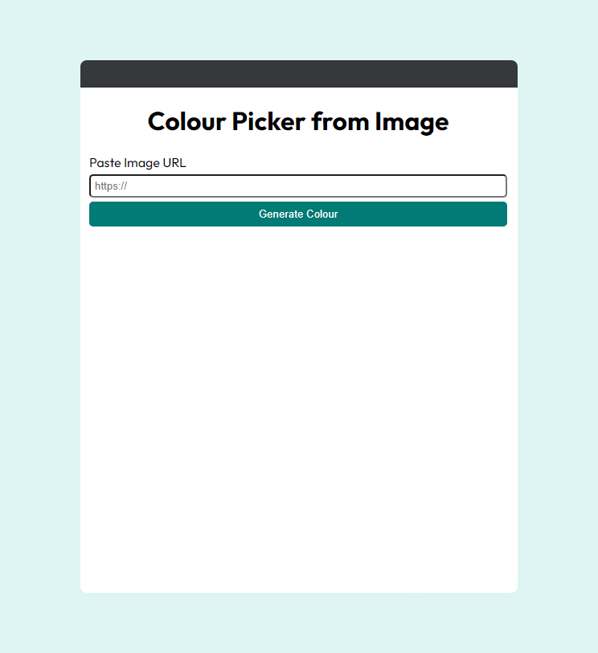

Below are our results and image! Go ahead, push your code to GitHub and share the application you have created to the world.

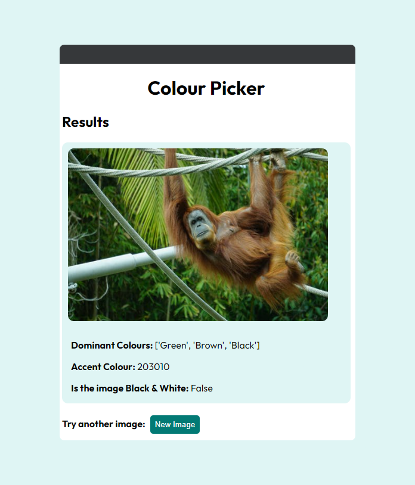

## **What’s next?**

> 💡 Now I can easily generate brand colour schemes in just a few seconds

The application is a basis of many ways you can analyze images and get results using Azure Computer Vision Services. I will continue exploring Flask and add additional functionalities to our app such as the ability to upload an image directly from your laptop. What other fun ways can you customize the app? 

## **Resources:**

Now that you have gone on this project journey with me, you can go out and check the following resources for further reading:

- [Analyze images with the Computer Vision service - Learn | Microsoft Docs](https://docs.microsoft.com/en-us/learn/modules/analyze-images-computer-vision/)
- [Computer Vision | Microsoft Azure](https://azure.microsoft.com/en-us/services/cognitive-services/computer-vision/#overview)
- [Computer Vision documentation - Quickstarts, Tutorials, API Reference - Azure Cognitive Services | Microsoft Docs](https://docs.microsoft.com/en-us/azure/cognitive-services/computer-vision/)
- [Sample: Explore an image processing app in C# - Azure Cognitive Services | Microsoft Docs](https://docs.microsoft.com/en-us/azure/cognitive-services/computer-vision/tutorials/csharptutorial)